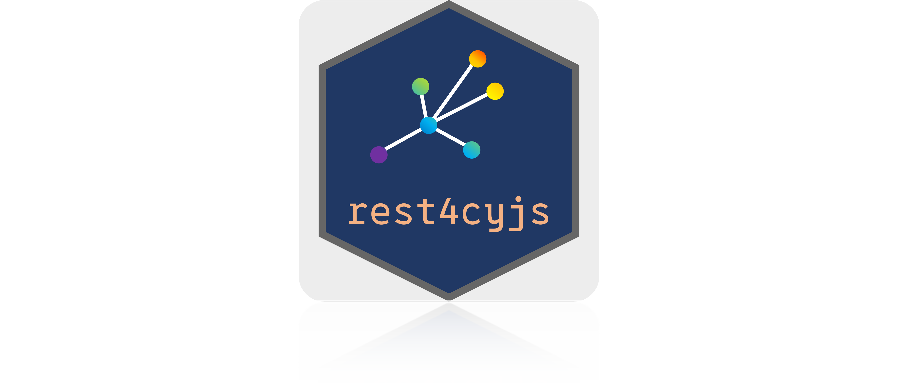

# rest4cyjs



<div align="center">
    <a href="https://github.com/kozo2/rest4cyjs" alt="Contributors">
        
    </a>
    <a href="https://github.com/kozo2/rest4cyjs" alt="Version">
        
    </a>
    <a href="https://github.com/kozo2/rest4cyjs" alt="forks">
        
    </a>
    <a href="https://github.com/kozo2/rest4cyjs" alt="forks">
        
    </a>
</div>

## frontend

- 使用言語: R
- port: 3000

## backend

- 使用言語: R
- port: 8000

### 使用するパッケージ

#### renv

### 使用を推奨している Visual Studio Code の拡張機能

#### Prettier - Code formatter

### フロントエンドのローカルサーバーの起動

```batnch
start-frontend.cmd
```

### バックエンドのローカルサーバーの起動

```batnch
start-backend.cmd
```

> [!NOTE]
> API ドキュメントの URL: http://127.0.0.1:8000/__docs__/
